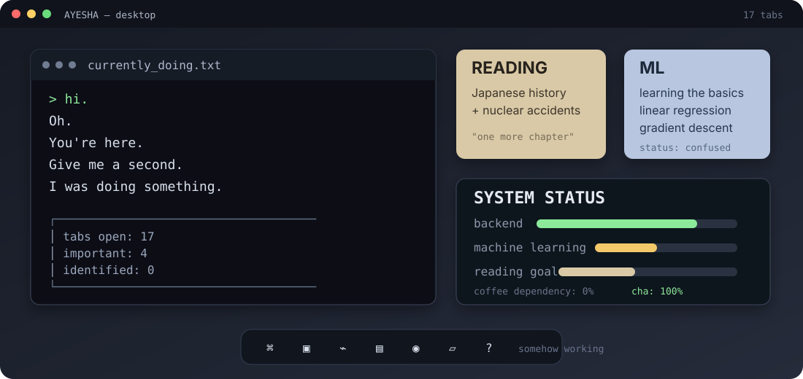

# Hi.

Oh.

You're here.

Give me a second.

I was doing something.

<p align="center">
  
</p>

### ⌁ Anyway.

I'm Ayesha.

I build software, mostly backend stuff, and lately I've been getting curious about **how AI actually works**.

---

# ⟡ Things I've built

## `01` ▸ CareerPilot

An AI-powered career assistant.

The idea was simple:

**give the AI useful information before asking it to answer.**

```text
documents → embeddings → search → relevant information → AI → answer
```

Then came the important question:

> **Why did it retrieve THAT?**

That's what got me interested in retrieval, embeddings, semantic search and RAG.

**Built with:**
`FastAPI` · `ChromaDB` · `Sentence Transformers` · `Redis` · `Docker`

---

## `02` ▸ [Jobscape](https://github.com/ayeshamashiat/Jobscape_Backend)

A job discovery backend.

Mostly APIs, databases and NLP.

The sort of project that starts with:

> “This should be pretty straightforward.”

It wasn't.

**Built with:**
`FastAPI` · `PostgreSQL` · `SQLAlchemy` · `Alembic` · `spaCy`

---

## `03` ▸ [PAMS Backend](https://github.com/ayeshamashiat/PAMS_Backend)

A backend system for APIs, business logic and data management.

**Built with:**
`Node.js` · `Express` · `JavaScript`

---

# ∴ The current rabbit hole

## Machine learning

I'm pretty new to it.

Right now I'm learning the fundamentals and trying to understand what's actually happening rather than immediately reaching for a library.

For example:

```python
model.fit(X, y)
```

I'd like to know what that line is actually doing.

Currently working through things like **linear regression, gradient descent, classification and the basics of neural networks**.

Very much a work in progress.

---

# ⌘ My toolbox

### Languages

| Language       | Mostly used for           |
| -------------- | ------------------------- |
| **Python**     | Backend, AI/ML, NLP       |
| **JavaScript** | Backend, web applications |
| **SQL**        | Database work             |

### Backend

`FastAPI` · `Node.js` · `Express`

REST APIs · Authentication · JWT · RBAC · Business Logic

### Databases

`PostgreSQL` · `MongoDB` · `MySQL`

### AI / ML

`NumPy` · `scikit-learn` · `spaCy` · `Sentence Transformers`

Currently exploring:

`Machine Learning` · `NLP` · `RAG` · `Embeddings` · `Transformers` · `LLMs`

### Infrastructure

`Docker` · `AWS` · `Nginx` · `GitHub Actions`

---

# ◇ STATUS REPORT

<table>
<tr>
<td align="center" width="25%">

### `17+`

Repositories

</td>
<td align="center" width="25%">

### `3×`

Hackathon Finalist

</td>
<td align="center" width="25%">

### `1×`

Top 100

</td>
<td align="center" width="25%">

### `1×`

Winning Project

</td>
</tr>
</table>

<br>

```text
┌──────────────────────────────────────────────────────┐
│                                                      │
│  BACKEND              Python · JavaScript             │
│  DATABASES            PostgreSQL · MongoDB · MySQL    │
│  AI PROJECTS          3+                              │
│  RAG PROJECTS         1                               │
│                                                      │
│  CURRENTLY LEARNING   Machine Learning                │
│  CURRENTLY EXPLORING  NLP · RAG · Embeddings          │
│                                                      │
└──────────────────────────────────────────────────────┘
```

---

# [ACHIEVEMENTS.log]

```text
┌────────────────────────────────────────────────────────────┐
│                                                            │
│  [TOP 100]                                                 │
│  Solvio AI Hackathon 2025                                  │
│                                                            │
│  [FINALIST]                                                 │
│  CodeSprint — Inter-IUT Hackathon                          │
│                                                            │
│  [FINALIST]                                                 │
│  SUST CSE Carnival Hackathon                                │
│                                                            │
│  [FINALIST]                                                 │
│  IUT 12th ICT Fest — Agentic AI Hackathon                  │
│                                                            │
└────────────────────────────────────────────────────────────┘
```

Three finalist finishes.

One Top 100 placement.

One winning project.

At this point I'm mostly collecting PDFs.

**[View the certificates →](YOUR_CERTIFICATES_LINK)**

---

# ▧ Currently open

```text
┌─ reading / learning ─────────────────────────────┐
│                                                   │
│  [01]  Japanese invasion era history              │
│  [02]  Nuclear accident rabbit hole               │
│  [03]  Goodreads yearly reading goal              │
│  [04]  Machine learning fundamentals              │
│                                                   │
└───────────────────────────────────────────────────┘
```

One of these is going significantly better than the others.

I will not tell you which one.

---

# ∿ One final thing

If you came here looking for **a developer**:

you found one.

If you came looking for **an AI/ML person**:

I'm getting there.

If you came looking for someone who can discuss **backend systems, RAG pipelines, nuclear disasters, Japanese history and books**:

we should probably talk.

---

### Thanks for snooping around.

**You may now return to whatever you were supposed to be doing.**
